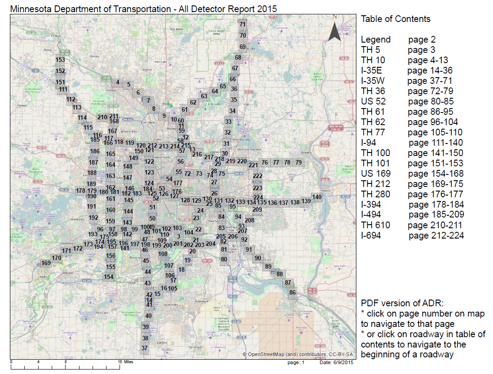
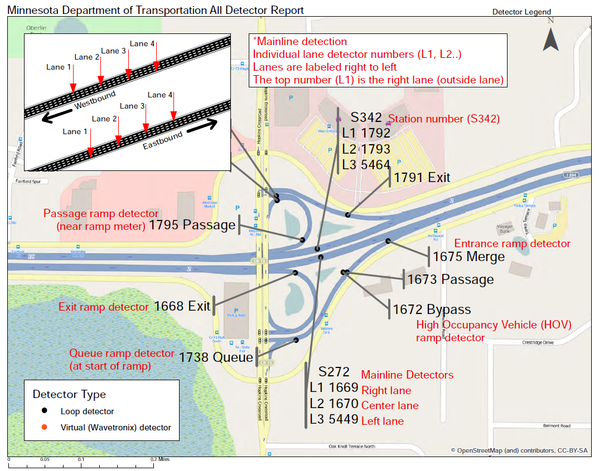
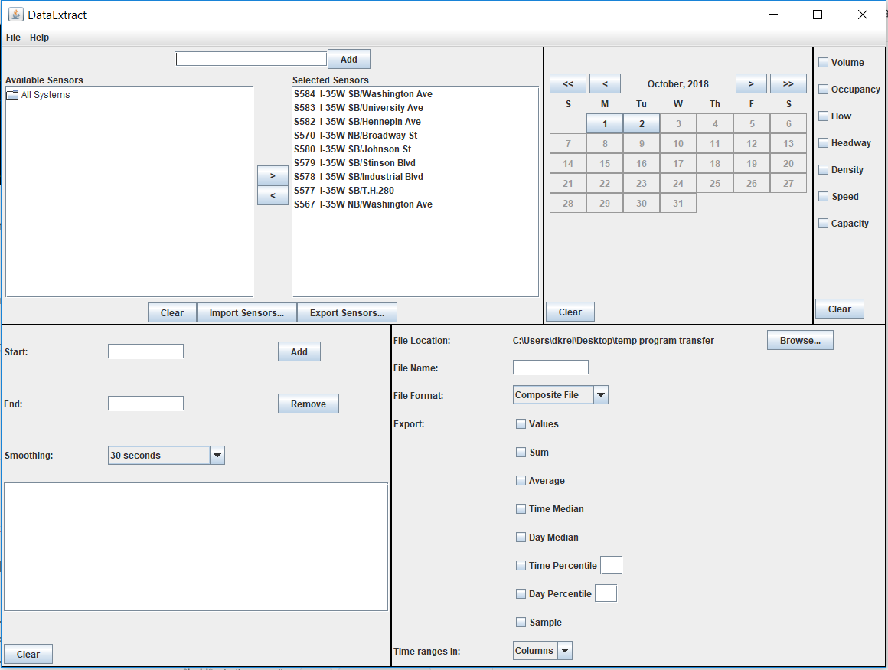
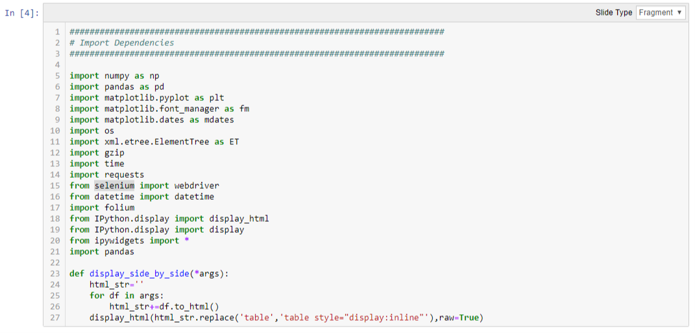

# Streprogen_Presentation
University of Minnesota Data Analytics and Visualization Boot Camp (2018-19)
Group Members:
* David Kreitzer
* Xander Roy
* Yongjin Jiang
* Jeff Olson

## Objective:
* Use Python and a Jupyter Notebook to gather, clean, and visualize any dataset that our team identifies.
* To view the full presentation in Slides click [here](https://dkreitzer.github.io/Streprogen_Presentation/)

## What data did we use?
* We wanted to understand the flow of Freeway Traffic to and from downtown Minneapolis, MN.
* MNDOT has approxiamtely 4,000 sensors throughout the twin cities Highway System that are constantly monitoring traffic.

* The sensors track activity in specific lanes, entrances, and exits.
* By looking at numberous sensors at once, we were able to determine speed, volumne, and direction of the traffic.

* The data also included information on accidents, construction, and incidents to help understand why traffic might have been impacted.

## How did we collect the data?
We accessed the data a couple different ways:
  * Bot running on Heroku to scrape XML's from MNDOT's site every 5 minutes
    * download | data_check | incidents | station_IDs | Route_Summary | Data_Request | Import_Summary
  * JAVA app to download historical data.

## What tools did we use to analyze the data?
Almost all of our work was complete using a Jupyter Notebook, and a little bit of data organizing in Excel.

## Animating the Data

Using data collected from the bot, we created a gif along Highway 35W that changed colors and width based on the speed and volume of traffic.

